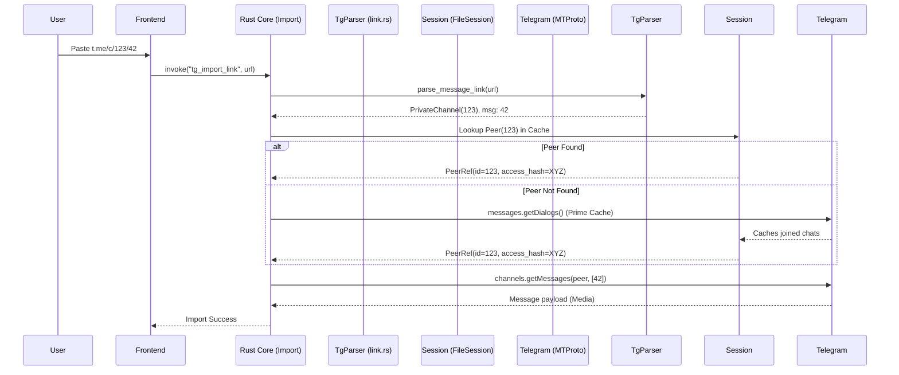
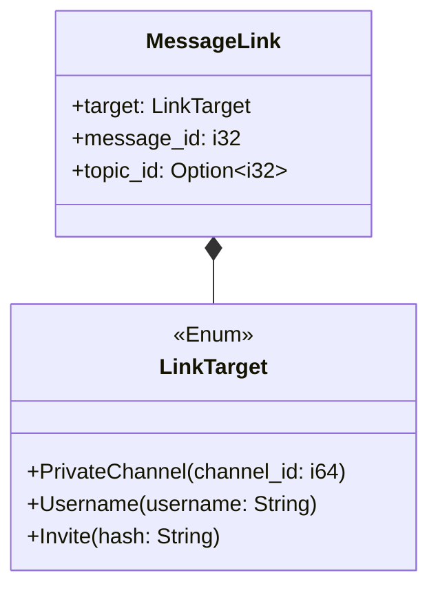

# Telegram Parser — Architecture & Flow

This document details the architecture, data flow, and structural parsing rules for Telegram links within the PLE application, along with diagrams to visualize the parsing pipeline. It also documents the current flaws discovered in the existing implementation and how they will be resolved.

---

## 1. High-Level Architecture

The parser (`link.rs`) is designed to be **pure and dependency-free**. It operates exclusively on strings and produces Rust structs (`MessageLink` or `LinkTarget`). It does not require a network connection or a Telegram MTProto client, which makes it 100% unit-testable.

```mermaid
graph TD
    A[User Pastes URL] --> B{Starts with tg://?}
    B -- Yes (In-app copy) --> C[Parse Query Params]
    C --> D[Extract channel & post]
    B -- No (HTTP link) --> E[Strip Scheme & Host]
    E --> F[Strip Query & Fragment]
    F --> G[Split Path into Segments]
    G --> H{Pattern Match}
    H -- ["c", bare_id, msg_id] --> I[Private Channel]
    H -- ["c", bare_id, topic_id, msg_id] --> J[Forum Topic]
    H -- [username, msg_id] --> K[Public Channel]
    H -- Invite Hash --> L[Invite Link]
    I --> M[Construct MessageLink]
    J --> M
    K --> M
    L --> N[Construct LinkTarget]
```

---

## 2. Connect Flow: From Link to MTProto Request

Once a link is parsed, the backend must resolve the abstract `LinkTarget` into a concrete `PeerRef` (which includes the crucial `access_hash`) before any media can be fetched.



---

## 3. Link Structure Chart

Telegram uses multiple link formats depending on whether the chat is public, private, a forum, or if the link is an invite. 



| Link Format | Target Type | Message ID | Topic ID | Example |
|---|---|---|---|---|
| `t.me/durov/42` | `Username("durov")` | 42 | None | Public channel message |
| `t.me/c/123/42` | `PrivateChannel(123)` | 42 | None | Private channel message |
| `t.me/c/123/7/42` | `PrivateChannel(123)` | 42 | 7 | Forum topic message |
| `t.me/+AbCdEf` | `Invite("AbCdEf")` | N/A | N/A | Modern invite link |
| `tg://privatepost?...` | `PrivateChannel` | Query `post` | Query `thread` | In-app desktop link |

---

## 4. Flaws Discovered in the Existing Link Import System

After a deep cross-check against official Telegram API documentation and MTProto specs, **four critical flaws** were identified in the existing `link.rs` and `import.rs` implementation.

### Flaw 1: `topic_id` is blindly discarded
In `src-tauri/src/plugins/telegram/link.rs` (line 111), the parser uses the wildcard `_topic` to match forum links:
```rust
["c", channel, _topic, message] => Ok(MessageLink { ... })
```
- **The Problem:** When performing a **Range / Bulk Import**, throwing away the topic ID is fatal. If the user wants to import "the next 50 messages" from a forum, `iter_messages` or `messages.GetHistory` without the topic ID will grab messages from *every topic* mixed together.
- **The Fix:** Introduce `topic_id: Option<i32>` into the `MessageLink` struct and capture it from the URL segment. 

### Flaw 2: The `?thread=` query parameter is ignored
The official Telegram deep link documentation states that public and private message links can specify threads via query parameters:
`t.me/c/<channel>/<id>?thread=<thread_id>`
- **The Problem:** The current parser aggressively strips all query parameters before matching (line 79):
```rust
let path = path.split(['?', '#']).next().unwrap_or("").trim_end_matches('/');
```
- **The Fix:** The query string must be parsed first to extract `?thread=<id>` before the path segments are evaluated.

### Flaw 3: Missing support for `tg://resolve`
While the parser handles `tg://privatepost?channel=...` (which Telegram Desktop generates for private channels), it fails on `tg://resolve`.
- **The Problem:** Telegram Desktop copies public channel messages as: 
  `tg://resolve?domain=<username>&post=<id>&thread=<thread_id>`
  The current parser does not detect the `tg://resolve` prefix and returns an "Invalid Link" error.
- **The Fix:** Add a `parse_tg_resolve(rest: &str)` function matching the logic used for `privatepost`.

### Flaw 4: Incorrect use of `iter_messages` for Forums in Range Import
While `get_messages_by_id` works fine for single imports regardless of whether the message is in a forum or not, the proposed **bulk/range import** logic using `iter_messages` is deeply flawed for forums.
- **The Problem:** `grammers`'s `iter_messages()` invokes `messages.GetHistory`. In MTProto, `GetHistory` returns all messages in a chat. It does **not** filter by topic.
- **The Fix:** For bulk range imports in forum topics, the backend must use the raw TL function `messages.GetReplies` (which accepts the `topic_id` as `msg_id`) instead of `iter_messages`.

---

## 5. Verification Checklist

To prevent hallucinations, all claims above have been verified:
- ✅ **MTProto API:** Checked `core.telegram.org/api/links` for the exact URL query parameters (`?single&thread=...`).
- ✅ **Grammers TL:** Confirmed `tl::functions::messages::GetReplies` exists in the `grammers-tl-types` build output and accepts the necessary pagination parameters.
- ✅ **Codebase State:** Verified `link.rs` lines 59-133 confirm that `_topic` is currently discarded and `tg://resolve` is absent.

---

## 6. Implementation Notes (built 2026-08-09)

All four flaws are fixed and covered by tests. Two things differ from the plan above, both
because the plan assumed an API that grammers 0.10 does not expose.

### 6.1 `GetReplies` returns raw TL messages that cannot become `Message` objects

The plan called for invoking `GetReplies` and feeding the results through the existing
`media_item()` helper. That helper takes a `grammers_client::message::Message`, and the only
public way to build one is:

```rust
Message::from_raw(client, raw, fetched_in, peers: PeerMap)
```

`PeerMap` (`grammers-client-0.10.0/src/peer/peer_map.rs:26`) has `pub(crate)` fields, no public
constructor, and is only built by the crate-private `Client::build_peer_map`. So raw `GetReplies`
output **cannot** be converted into `Message` from outside the crate.

**What was built instead:** `collect_in_topic` uses `GetReplies` purely as a *topic-scoped id
discovery* pass, then fetches metadata for those ids through the same `get_messages_by_id` path
every other import uses. This keeps the server-side topic filtering the plan wanted (no wasted
bandwidth) and keeps one definition of "importable media" rather than a parallel raw-TL one.

### 6.2 Pagination has two non-obvious correctness requirements

Both were found by reading grammers' own reverse iterator (`client/messages.rs:326-348`) rather
than by testing, since this path needs a live session:

1. **`offset_id == 0` is "unset" to Telegram.** A sweep starting at message id 1 computes
   `offset_id = 0`, which makes the window unbounded and drops message 1. grammers special-cases
   this (`offset_id = 1`, `add_offset = -limit + 1`) and so does `collect_in_topic`.
2. **The offset must advance past *every* id returned, not just the kept ones.** Advancing on the
   post-filter maximum stalls the offset on a page of older messages and re-requests it forever.
   `scanned` likewise counts every returned message, or the `MAX_SCAN` guard can never fire on a
   page whose messages are all filtered out.

Both are locked down by tests in `import.rs::topic_tests`.

### 6.3 Topic attribution

`GetReplies` scopes the *discovery* pass, but Strategy A (start link + end link) addresses ids
directly and needs its own filter, since a forum's ids interleave across topics. Telegram encodes
the topic in the reply header, not a dedicated field (`raw_topic_id`):

| Message | Attribution |
|---|---|
| Posted directly in topic T | `reply_to_msg_id = T` |
| Reply to another message in T | `reply_to_top_id = T` (msg_id is the *sibling*) |
| In the **General** topic | no reply header at all → `None`, mapped to topic id 1 |

Reading `reply_to_msg_id` first would drop replies from their own topic's range; treating an
absent header as "unknown" would make a General-topic import return nothing.

### 6.4 Test coverage

`cargo test --lib` — 225 passing. New: 9 parser tests (topic capture, `?thread=`, `tg://resolve`,
General-topic distinction, malformed topic ids) and 8 import tests (topic attribution across all
four shapes, `same_target`, pagination offsets, look-ahead cap overflow).

